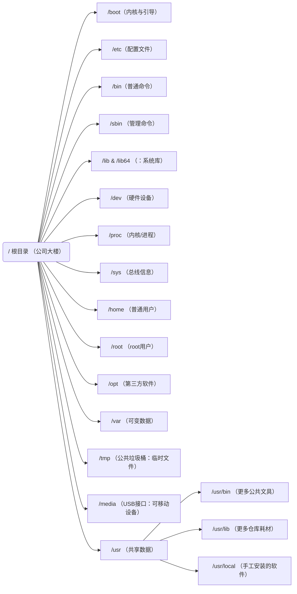

命令基本格式： command  +[ 选项 ]  +[参数（ 操作对象的路径 ）]   
```bash
#例如：
ls -a  /etc
```

说明：
1、极个别不遵循。
2、当有多个选项时，可以写在一起，例如：ls -alt，就是-a 、-l、-t组合在一起的|
3、有简化选项和完整选项，
	- 简化选项用 "-a"表示，
	- 完整选项用"--all"表示，
	如：du --max -depth=1 -ah

记忆要点：记单词

# 一. 文件管理系统

一切皆文件

Linux的一切皆文件是指，Linux世界中的所有、任意、一切东西都可以通过文件的方式访问、管理。
Linux 基金会发布的 FHS 标准: 
	FHS（Filesystem Hierarchy Standard），文件系统层次化标准，该标准规定了 Linux 系统中所有一级目录以及部分二级目录（/usr 和 /var）的用途。

## 1. 文件目录

Linux的目录结构一开始看起来可能很杂乱，但如果按照**“谁在用”**和**“用来干什么”**的逻辑来分类，就非常容易记忆。下面我为你梳理了一套分类记忆法。

可以把整个Linux文件系统想象成一个**公司（操作系统）**的办公楼（根目录`/`）。不同楼层和房间存放不同的东西，由不同的人（用户、管理员、内核）使用。


### 1.1 核心启动区

| /boot/ | 这里存放着Linux内核（相当于公司的大脑）和引导程序（GRUB）的配置文件。电脑开机时，最先读取的就是这里。 |
| :----- | :------------------------------------------------------ |
|        |                                                         |


### 1.2 系统管理员专用区

| **/etc/**     | etcetera 配置文件保存位置。<br />保存系统内所有采用默认安装方式（rpm 安装）的服务配置文件，<br />如用户信息、服务的启动脚本、常用服务的配置文件等               |
| :------------ | :-------------------------------------------------------------------------------------------------- |
| /sbin/        | 系统管理命令。<br />system binary 挂载目录。<br />保存与系统环境设置相关命令，只有 root 可以使用这些命令进行系统环境设置，<br />但也有些命令可以允许普通用户查看 |
| /bin/         | 普通命令。binary，二进制文件。<br />存放系统命令，普通用户和 root 都可以执行。<br />挂载目录，放在 /bin 下的命令在单用户模式下也可以执行                 |
| /lib和/lib64   | 系统库。<br />`Library`。存放系统运行必需的动态链接库（相当于Windows的DLL文件）。<br />`/bin` 和 `/sbin` 里的命令运行需要依赖这里的“耗材”。      |
| /lost + found | 文件修复区。每个分区都有。<br />当系统异常关机或崩溃后，下次启动会运行磁盘检查，找到的碎片文件会放这里。                                             |


### 1.3 内核与硬件交互区

| /dev  | 设备文件。`Devices`。<br />硬盘（`/dev/sda`）、U盘（`/dev/sdb1`）、键盘、鼠标，都映射成一个文件。                                              |
| :---- | :--------------------------------------------------------------------------------------------------------------- |
| /proc | 进程与内核信息。`Process Information`。<br />这是一个虚拟文件系统，里面的数据都在**内存**里。<br />显示当前运行的进程和内核信息（如 `cat /proc/cpuinfo` 查看CPU）。 |
| /sys  | 设备与总线信息。`System`。类似于`/proc`，<br />但更专注于以树状结构展示硬件设备间的连接关系（如USB总线、PCI设备）。                                          |

### 1.4 用户数据区

| **/root** | 超级系统管理员（root）的专属目录。它不在 `/home` 下，是为了保证系统出问题时，管理员能登录修复。                 |
| :-------- | :--------------------------------------------------------------------- |
| **/home** | 用户目录                                                                   |
| **/opt**  | 可选软件包。`Optional`。通常用来安装那些不遵循标准目录结构的第三方大型软件，比如谷歌 Chrome 浏览器、Oracle 数据库。 |
| **/srv**  | 服务数据。`Service`。当你把Linux作为服务器（如Web服务器、FTP服务器）时，存放这些服务所提供的数据（如网站文件）。     |

### 1.5 动态与临时文件区

| **`/var`** | **可变数据**。`Variable`。存放经常变化的数据，比如系统日志（`/var/log`）、打印任务队列、数据库文件。**日志**是查错的第一站。 |
| :--------- | :--------------------------------------------------------------------------- |
| /tmp       | 临时文件。`Temporary`。存放临时文件，**系统重启后，这里通常会被清空**。任何人都可以在这里创建文件。                    |
| /run       | 运行数据。存放自系统启动以来正在运行的服务所需的临时文件（如进程ID）。系统重启后会清空。                                |
|            |                                                                              |


### 1.6 特殊挂载点 — 可移动设备接口

| /   | /media | 当你插入U盘、手机或光盘时，系统通常会自动把它们挂载到这里的一个子目录下。**可移动媒体挂载点（USB接口）**        |
| --- | :----- | :-------------------------------------------------------------- |
|     | /mnt   | **临时挂载点（临时接线口）**`Mount`。以前是给系统管理员手动挂载临时文件系统（如Windows分区、网络存储）用的。 |




`
## 2.文件管理

### 2.1 文件属性

```bash
# 示例
-rw-r--r-- 1 root root  1234 Apr 23 10:30 file.txt

```
#### 2.1.1 文件类型（第 1 个字符）

- `-` 普通文件
- `d` 目录
- `l` 符号链接
- `c` 字符设备
- `b` 块设备
- `p` 管道
- `s` 套接字

#### 2.1.2 权限（第 2-10 个字符，共 9 位）

分为三组：所有者（user）、所属组（group）、其他人（other）  
每组顺序：`r`（读）、`w`（写）、`x`（执行）  
例：`rw-r--r--` 表示所有者可读写，组和其他人只读。

#### 2.1.3 硬链接数

对于文件：指向该文件 inode 的链接数量  
对于目录：至少为 2（`.` 和 `..`）

#### 2.1.4. 所有者（user）和所属组（group）

文件所属的用户和组。

#### 2.1.5. 文件大小（以字节为单位）

普通文件显示字节数；目录显示其元数据大小（非内容总大小）。

#### 2.1.6. 时间戳

默认为最近一次**修改**时间（mtime）。也可用 `stat` 查看访问时间（atime）、状态改变时间（ctime）。

#### 2.1.7. 文件名（或目录名）

#### 其他常用命令查看属性

- `stat <file>` – 详细显示所有时间戳、inode 等
    
- `ls -li` – 显示 inode 编号
    
- `ls -lh` – 人类可读的文件大小（K/M/G）

### 2.2 用户

#### 创建用户

```bash
# 创建用户并自动创建家目录
sudo useradd -m username
# 设置密码
sudo passwd username
```

#### 切换用户

| **命令** | 选项  | **英文**      | **作用** |
| ------ | --- | ----------- | ------ |
| su     |     | switch user | 切换用户   |
|        |     |             |        |

### 2.3 文件操作命令

#### cd

| **命令** | 选项  | **英文**           | **作用**     |
| ------ | --- | ---------------- | ---------- |
| cd     |     | change directory | 切换目录       |
|        | ..  |                  | 返回上一级      |
|        | -   |                  | 返回上一次访问的目录 |
#### ls

| **命令** | 选项  | **英文**    | **作用**            |
| ------ | --- | --------- | ----------------- |
| ls     |     | list      | 列出文件，不包括隐藏文件      |
|        | -a  | list all  | 列出所有文件            |
|        | -l  | 简写ll      | 使用长格式列出文件及目录的详细信息 |
|        | -t  | list time | 按最后修改时间排序显示文件     |
|        | -R  | Recursion | 递归显示所有子目录         |
|        | -m  |           |                   |
#### pwd

| **命令** | 选项  | **英文**                  | **作用**       |
| ------ | --- | ----------------------- | ------------ |
| pwd    |     | Print Working Directory | 显示你当前所在的工作目录 |
#### mkdir

| **命令** | 选项  | **英文**         | **作用**                  |
| ------ | --- | -------------- | ----------------------- |
| mkdir  |     | make directory | 创建目录.可以批量创建：mkdir a b c |
#### touch

| **命令** | 选项  | **英文** | **作用** |
| ------ | --- | ------ | ------ |
| touch  |     |        | 创建文件   |
#### rm 

| **命令** | 选项  | **英文**          | **作用**      |
| ------ | --- | --------------- | ----------- |
| rm     |     | remove          | 移除文件        |
|        | -r  | recursion       | 递归删除        |
|        | -f  | force           | 强制删除，不会询问   |
|        | -rf | recursion foucs | 递归移除所有子目录文件 |
#### history

| **命令**  | 选项  | **英文** | **作用**               |
| ------- | --- | ------ | -------------------- |
| history |     |        | 查找历史命令               |
|         |     |        | 可以用！+命令前的数字执行对应的历史命令 |
|         |     |        |                      |
#### mv


#### cp

| **命令** | 选项  | **英文**          | **作用**                    |
| ------ | --- | --------------- | ------------------------- |
| cp     |     | copy            | 通常会覆盖                     |
|        | -i  | **interactive** | 覆盖前确认                     |
|        | -n  | **no-clobber**  | 不覆盖                       |
|        | -f  | force           | 强制覆盖（与 `-i` 同时使用时，后指定的生效） |


# 二. 文档

| **命令** | 选项  | **英文** | **作用** |
| ------ | --- | ------ | ------ |
| vim    |     |        |        |
|        |     |        |        |

| **命令** | 选项  | **英文**      | **作用**                   |
| ------ | --- | ----------- | ------------------------ |
| cat    |     | concatenate | 查看文件，一般选择较小文件，一屏幕能够完全查看的 |
|        | -n  | num         | 显示行数                     |

| **命令** | 选项  | **英文** | **作用**   |
| ------ | --- | ------ | -------- |
| head   |     | head   | 显示文件头部信息 |

| **命令** | 选项  | **英文** | **作用**   |
| ------ | --- | ------ | -------- |
| head   |     | head   | 显示文件头部信息 |

| **命令** | 选项  | **英文**                                                  | **作用**                              |
| ------ | --- | ------------------------------------------------------- | ----------------------------------- |
| grep   |     | global search regular expression and print out the line | '管道符，“\|”，表示将前一个命令的处理结果输出传递给后面的命令处理 |
|        |     |                                                         |                                     |
|        | -r  | recursion                                               | 递归搜索子目录                             |
|        | -i  | ingore                                                  | 忽略大小写                               |
|        | -n  | num                                                     | 显示行号                                |
|        |     |                                                         |                                     |

```bash
grep -rin --color "你要找的内容" ./
```
# 三. 系统管理

### 1. 基本概念

- 线程：
- 进程：计算机中，一个正在执行中的程序或命令。一个进程可以包含很多线程
- 服务：启动之后一直存在、**常驻内存的进程**，一般被称作“服务”（service）。


### 2. 进程相关命令

#### top

| **命令** | 选项  | **英文** | **作用**   |     |
| ------ | --- | ------ | -------- | --- |
| top    |     |        | 实时监控系统进程 |     |
|        |     |        |          |     |
|        |     |        |          |     |
- PID: 进程ID号
- PPID:该进程的父ID
- %CPU：该进程占用CPU资源的百分比，占用越高，进程越耗费资源；
- ％MEM：该进程占用物理内存的百分比，占用越高，进程约好非资源；
- VSZ：该进程占用虚拟内存的大小，单位KB;
- RSS：该进程占用物理内存的大小，单位KB；
- TTY：该进程是在哪个终端中运行的。对于CentOS 来说，tty1是图形化终端，tty2-tty6是本地字符界面终端。Pts/0-255代表虚拟终端。
- STAT：进程状态，
- START：进程启动时间，
- TIME：占用CPU的时间，大部分启动之后就进入sleep状态，等待
#### ps

| **命令** | 选项  | **英文**         | **作用** |
| ------ | --- | -------------- | ------ |
| ps     |     | process status | 进程状态   |
|        |     |                |        |
|        |     |                |        |

### 3.服务相关命令

#### systemctl
```shell
# 查看指定服务的详细状态
systemctl status ccxt_trading

# 启动服务
systemctl start ccxt_trading

# 停止服务
systemctl stop ccxt_trading

# 查看服务日志
```

#### watch
```bash
  watch -n 1 "sudo journalctl -u ccxt_trading --since '1 minute ago' -n 14 --no-pager"
```

# 四. 软件包管理


| **命令** | 选项  | **英文**         | **作用** |
| ------ | --- | -------------- | ------ |
| rpm    |     | process status | 进程状态   |
|        |     |                |        |

| **命令** | 选项  | 参数  | **英文**                      | **作用** |
| ------ | --- | --- | --------------------------- | ------ |
| yum    |     |     | Yellow dog Updater Modified | 进程状态   |
|        | -y  |     | yes 对所有提问都回答yes             |        |

# 五. 磁盘管理

#### du

| **命令** | 选项  | **英文**     | **作用**     |
| ------ | --- | ---------- | ---------- |
| du     |     | disk usage | 查看磁盘文件使用情况 |
|        |     |            |            |
|        |     |            |            |

|   |   |   |   |
|---|---|---|---|
 
# 六. 文件传输

|     |     |     |     |
| --- | --- | --- | --- |
|     |     |     |     |
 
# 七. 网络通讯


#### 查看 /etc/os-release 或发行版特定文件

```bash
cat /etc/os-release   # **opencloudOS属于 RHEL/CentOS 生态**
```

查看腾讯云公网 ip地址
curl http://metadata.tencentyun.com/meta-data/public-ipv4


# 八. 设备管理


# 九. 备份压缩


