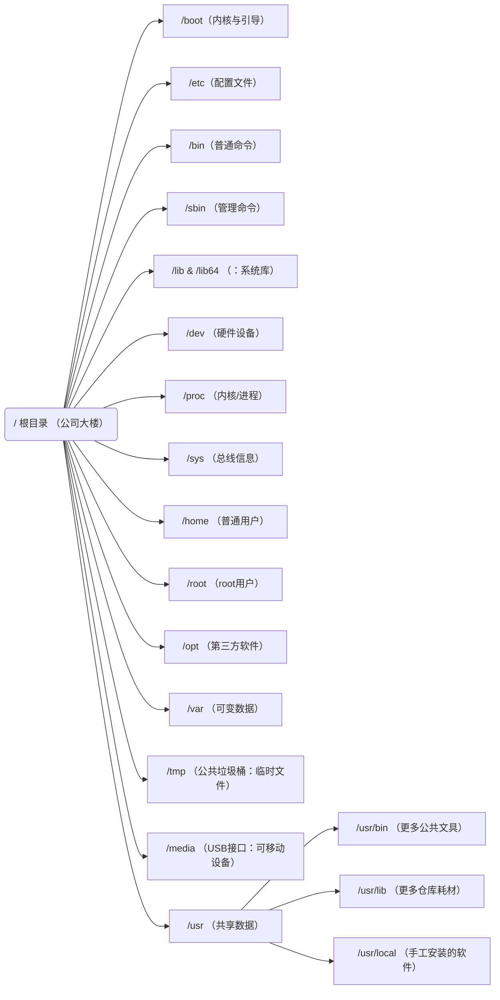

命令基本格式： command  +[ 选项 ]  +[参数（ 操作对象的路径 ）]   例如：ls -a  /etc

说明：
1、极个别不遵循。
2、当有多个选项时，可以写在一起，例如：ls -alt，就是-a 、-l、-t组合在一起的|
3、有简化选项和完整选项，简化选项用 "-a"表示，完整选项用"--all"表示，如：du --max -depth=1 -ah
# 一. 文件管理系统

一切皆文件

Linux的一切皆文件是指，Linux世界中的所有、任意、一切东西都可以通过文件的方式访问、管理。
Linux 基金会发布的 FHS 标准: 
	FHS（Filesystem Hierarchy Standard），文件系统层次化标准，该标准规定了 Linux 系统中所有一级目录以及部分二级目录（/usr 和 /var）的用途。

## 1.文件目录

Linux的目录结构一开始看起来可能很杂乱，但如果按照**“谁在用”**和**“用来干什么”**的逻辑来分类，就非常容易记忆。下面我为你梳理了一套分类记忆法。

可以把整个Linux文件系统想象成一个**公司（操作系统）**的办公楼（根目录`/`）。不同楼层和房间存放不同的东西，由不同的人（用户、管理员、内核）使用。
### 1.1  核心启动区 —— 公司的前台与机房

这部分是系统启动和修复所必需的，**千万不要随意删除或修改**。

- **`/boot`**：**启动目录（机房）**。
    
    - **记忆点**：这里存放着Linux内核（相当于公司的大脑）和引导程序（GRUB）的配置文件。电脑开机时，最先读取的就是这里。
        
- **`/efi` （或 /boot/efi）**：**UEFI启动分区**。
    
    - **记忆点**：如果你的电脑使用UEFI（新型BIOS）启动，这里存放着引导加载程序。可以看作是机房的**配电箱**。
        
- **`/`**：**根目录（公司大楼本身）**。
    
    - **记忆点**：所有目录的起点。倒着看树结构，它就是树根。
### 1.2 系统管理员专用区 —— 行政财务部

这部分主要存放系统级别的配置文件、命令和库文件，通常只有管理员（`root`）才有权限随意改动。

- **`/etc`**：**配置文件（行政部的文件柜）**。
    
    - **记忆点**：`Editable Text Configuration`。系统的几乎所有配置文件都在这（如用户密码、网络设置）。装软件改设置，常来这里。
        
- **`/sbin`**：**系统管理命令（行政部专用钥匙）**。
    
    - **记忆点**：`System Binaries`。只有管理员（root）才能使用的系统级管理命令，比如格式化磁盘、修改系统时间（`fdisk`, `init`）。
        
- **`/bin`**：**普通命令（公司公共文具）**。
    
    - **记忆点**：`Binaries`。存放所有用户都能用的基础命令（如 `ls`, `cp`, `mv`）。无论你是普通员工还是老板，都能用。
        
- **`/lib` 和 `/lib64`**：**系统库（行政部的耗材仓库）**。
    
    - **记忆点**：`Library`。存放系统运行必需的动态链接库（相当于Windows的DLL文件）。`/bin` 和 `/sbin` 里的命令运行需要依赖这里的“耗材”。
        
- **`/lost+found`**：**文件修复区（行政部的失物招领处）**。
    
    - **记忆点**：每个分区都有。当系统异常关机或崩溃后，下次启动会运行磁盘检查，找到的碎片文件会放这里。

### 第三类：内核与硬件交互区 —— 机房监控室

这部分是虚拟目录，反映了正在运行的硬件和内核状态，不占用硬盘空间。

- **`/dev`**：**设备文件（监控屏幕上的设备图标）**。
    
    - **记忆点**：`Devices`。硬盘（`/dev/sda`）、U盘（`/dev/sdb1`）、键盘、鼠标，都在这里映射成一个文件。
        
- **`/proc`**：**进程与内核信息（实时的系统监控表）**。
    
    - **记忆点**：`Process Information`。这是一个虚拟文件系统，显示当前运行的进程和内核信息（如 `cat /proc/cpuinfo` 查看CPU）。里面的数据都在**内存**里。
        
- **`/sys`**：**设备与总线信息（更详细的硬件拓扑图）**。
    
    - **记忆点**：`System`。类似于`/proc`，但更专注于以树状结构展示硬件设备间的连接关系（如USB总线、PCI设备）。 

### 第四类：用户数据区 —— 员工工位与公共区域

这部分存放用户产生的数据和软件包。

- **`/home`**：**普通用户的家（员工的私人工位）**。
    
    - **记忆点**：每个普通用户在这里都有一个以自己用户名命名的文件夹（如 `/home/zhangsan`）。你的文档、照片、下载文件都默认在这。
        
- **`/root`**：**超级管理员的家（董事长的独立办公室）**。
    
    - **记忆点**：系统管理员（root）的专属目录。它不在 `/home` 下，是为了保证系统出问题时，管理员能登录修复。
        
- **`/opt`**：**可选软件包（大型商业软件专卖店）**。
    
    - **记忆点**：`Optional`。通常用来安装那些不遵循标准目录结构的第三方大型软件，比如谷歌 Chrome 浏览器、Oracle 数据库。
        
- **`/srv`**：**服务数据（服务器对外服务的展厅）**。
    
    - **记忆点**：`Service`。当你把Linux作为服务器（如Web服务器、FTP服务器）时，存放这些服务所提供的数据（如网站文件）。
        

### 第五类：动态与临时数据区 —— 仓库与垃圾站

这部分存放的是经常变化的、或者临时的文件。

- **`/var`**：**可变数据（公司的仓库/日志室）**。
    
    - **记忆点**：`Variable`。存放经常变化的数据，比如系统日志（`/var/log`）、打印任务队列、数据库文件。**日志**是查错的第一站。
        
- **`/tmp`**：**临时文件（公共垃圾桶）**。
    
    - **记忆点**：`Temporary`。存放临时文件，**系统重启后，这里通常会被清空**。任何人都可以在这里创建文件。
        
- **`/run`**：**运行时数据（茶水间的即时贴）**。
    
    - **记忆点**：存放自系统启动以来正在运行的服务所需的临时文件（如进程ID）。系统重启后会清空。
        

### 第六类：特殊挂载点 —— 可移动设备接口

- **`/media`**：**可移动媒体挂载点（USB接口）**。
    
    - **记忆点**：当你插入U盘、手机或光盘时，系统通常会自动把它们挂载到这里的一个子目录下。
        
- **`/mnt`**：**临时挂载点（临时接线口）**。
    
    - **记忆点**：`Mount`。以前是给系统管理员手动挂载临时文件系统（如Windows分区、网络存储）用的。

`

