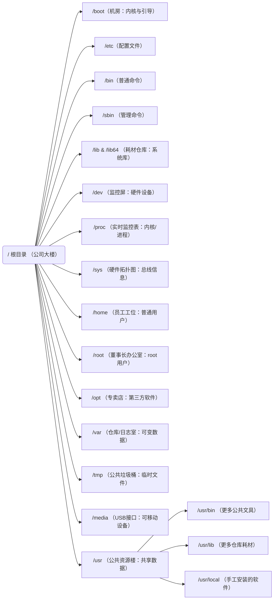
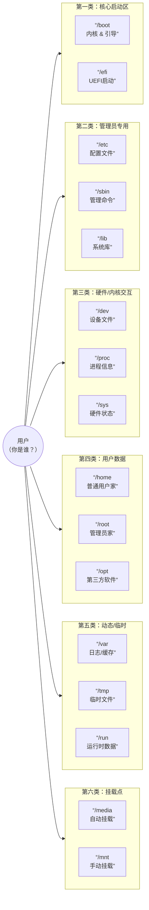

命令基本格式： command  +[ 选项 ]  +[参数（ 操作对象的路径 ）]   例如：ls -a  /etc

说明：
1、极个别不遵循。
2、当有多个选项时，可以写在一起，例如：ls -alt，就是-a 、-l、-t组合在一起的|
3、有简化选项和完整选项，简化选项用 "-a"表示，完整选项用"--all"表示，如：du --max -depth=1 -ah
# 一. 文件管理系统

一切皆文件

Linux的一切皆文件是指，Linux世界中的所有、任意、一切东西都可以通过文件的方式访问、管理。
Linux 基金会发布的 FHS 标准: FHS（Filesystem Hierarchy Standard），文件系统层次化标准，该标准规定了 Linux 系统中所有一级目录以及部分二级目录（/usr 和 /var）的用途。

`
