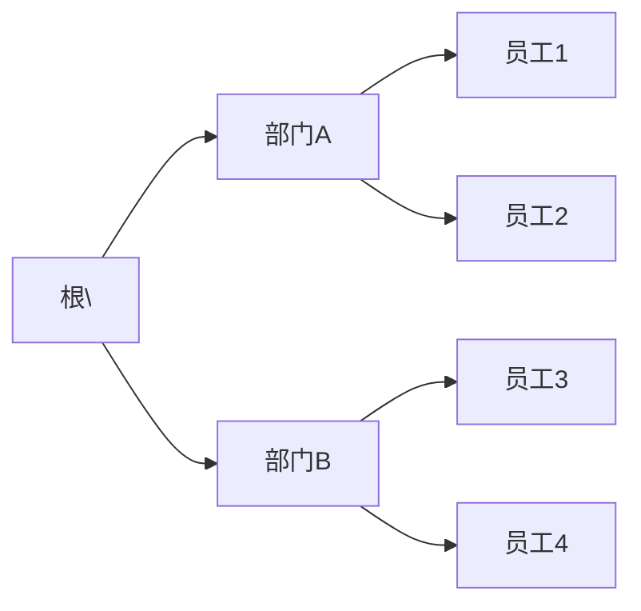

一切皆文件

Linux的一切皆文件是指，Linux世界中的所有、任意、一切东西都可以通过文件的方式访问、管理。

```mermaid
graph LR
    Root[根\] --> A[部门A]
    Root --> B[部门B]
    A --> A1[员工1]
    A --> A2[员工2]
    B --> B1[员工3]
    B --> B2[员工4]

```

`
