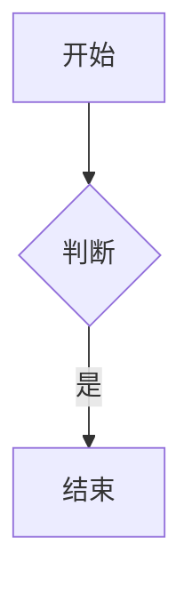

### 1.1 基础语法结构

graph TD
    A[开始] --> B{判断}
    B -->|是| C[结束]

**语法规则：**

- `graph` 或 `flowchart` 开头
    
- `TD` / `TB`：从上到下 | `LR`：从左到右 | `BT`：从下到上
    
- `-->`：箭头连接 | `---`：无箭头连接
    
- `|文字|`：连线上的标签